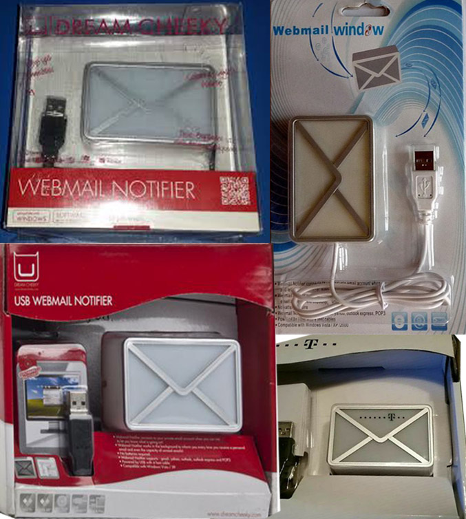
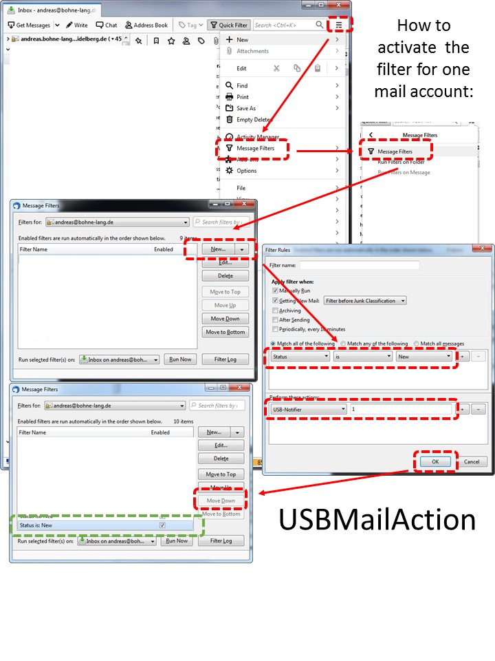

# Thunderbird Add-On for interfacing Dream Cheeky DL100B Webmail Notifier. 


This Thunderbird add-on installs a custom action filter provides interface to a binary program that can set a color and can switch on and off the USB-device. On incoming mails you can let blink the LED device.

The Add-on installs a binary program on the computer to interface the hardware. Maybe a antivirus programm will check it while installation. All binaries are build on a Linux host. There are binaries for Windows, Linux and Mac ind a 32bit and 64bit program. 





## Installation:

Unitl this extension is not in the official Thunderbird repository you need to download and install this manualy. 

Download the xpi-file for a local device. First open the main menu (see section "Settings" for an image) and scroll down until Add-ons. Click. Click again the Add-ons entry in the new box. Then open the menu (right top) and choose "Install Add-on from File". 


Important: On Linux devices you need to allow normal user to access hardware like this USB-device. You need to intall an udev-rule (see 24-LED-notifier.rules). Otherwise only root can access the USB-device.

## Activate and enable Filter
For each mail account you can enable a filter and you can set different colores. The following images shows how to enable this new custom filter. 



## Settings properties
There is only one property you can set - Debug enabled.


## Acknowledgment
This project combines experience and code from other developer. A big thank you to this people:
- Axel Grude (Realraven) for his FiltaQuilla and ToneQuilla [https://github.com/RealRaven2000](https://github.com/RealRaven2000) 
- R Kent James (rkent) [https://github.com/rkent/](https://github.com/rkent/glodaquilla)
- Paweł Tomulik (ptomulik) [https://github.com/ptomulik](https://github.com/ptomulik) 
- Paul Gallagher (tardate) for the blincy.c code [LittleArduinoProjects/8051/AT89C2051/Blinky](https://github.com/tardate/LittleArduinoProjects/blob/master/8051/AT89C2051/Blinky/README.md)
- Alan Ott (signal11) for his multi-platform HID-API [signal11/hidapi](https://github.com/signal11/hidapi)
- Damien Zammit (zamaudio) for the cross mac environment [zamaudio/cross-apple](https://github.com/zamaudio/cross-apple)
- phracker [phracker/MacOSX-SDKs](https://github.com/phracker/MacOSX-SDKs)

Special thanks to Axel who answered my questions and provided a lot of very helpful pieces of advice!


## Related but not used information to this USB-device:
- JavaScript Node code:  [Dream-Cheeky-USB-WebMail-Notifier](https://github.com/kniffen/Dream-Cheeky-USB-WebMail-Notifier/blob/master/usbwn.js)
- Nativ Linux kernel module: [Webmail Notifier Linux Driver] (https://github.com/nathan-osman/Webmail-Notifier-Linux-Driver)
- Linux-Kernel driver for hidraw interface: [linux/drivers/hid/hid-led.c

```
dmesg 
 ...
  usb 3-4: new low-speed USB device number 6 using ohci-pci
  usb 3-4: New USB device found, idVendor=1294, idProduct=1320, bcdDevice= 1.00
  usb 3-4: New USB device strings: Mfr=1, Product=2, SerialNumber=0
  usb 3-4: Product: MAIL 
  usb 3-4: Manufacturer: MAIL 
  hid-led 0003:1294:1320.0003: hidraw0: USB HID v1.10 Device [MAIL  MAIL ] on usb-0000:00:13.1-4/input0
  
 Switch led on / off on bash level:
 sudo echo "1" > /sys/class/leds/riso_kagaku0\:blue/brightness 
 sudo echo "0" > /sys/class/leds/riso_kagaku0\:blue/brightness
```
